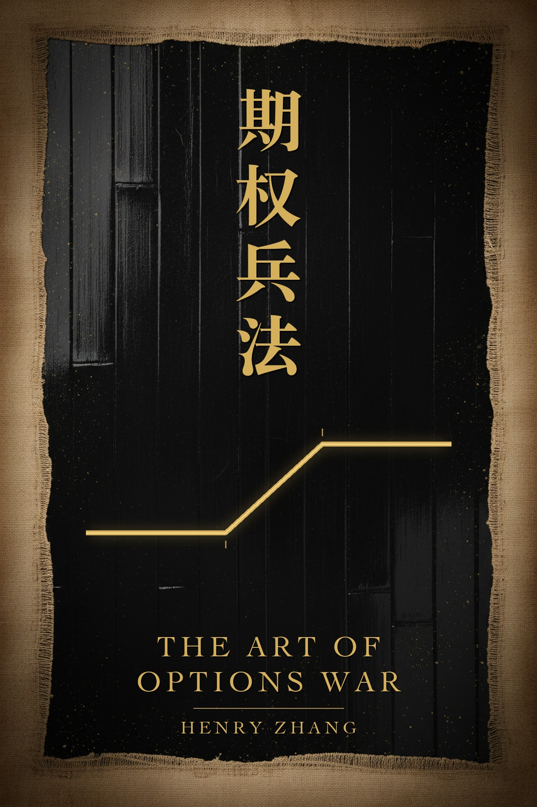

# The Art of Options War · 期权兵法

**Sun Tzu's thirteen chapters, in his order and on his subjects, read against a single trade: the defined-risk credit spread.**

Two and a half thousand years ago a general wrote thirteen short chapters on how to win without being destroyed. He was not interested in glory. He was interested in the arithmetic of survival: which battles to fight, which to refuse, how to be paid by an enemy's mistakes instead of your own courage, and why the state that wins every battle can still lose the war.

Selling options is the same problem in a different uniform. The seller is paid to hold a line. He does not need to know where the enemy will go, only where the enemy will not arrive in time. He wins most engagements and can be ruined by one.

Numbered aphorisms with a commentary, in the manner of the Giles translation. No forecasts, no signals, no performance claims.

## Read it

| | English | 中文 |
|---|---|---|
| Contents | **[Start here](en/README.md)** | **[从这里开始](zh/README.md)** |
| One file | [The whole book](en/the-whole-book.md) | [全书单页](zh/the-whole-book.md) |
| Prologue | [Before the Temple Count](en/prologue.md) | [序：庙算之前](zh/prologue.md) |

Both editions were written by hand. The Chinese is not a machine translation of the English, and the English is not a translation of the Chinese — they are the same book written twice.

## The thirteen chapters

| | | | |
|---|---|---|---|
| **Part I — The Count** | 1. [Counting in the Temple](en/chapter-01.md) 《庙算》 | 2. [The Cost of the Campaign](en/chapter-02.md) 《作战》 | 3. [Winning Without Fighting](en/chapter-03.md) 《谋攻》 |
| **Part II — Shape and Force** | 4. [The Unbeatable Position](en/chapter-04.md) 《军形》 | 5. [Force and the Four Quarters](en/chapter-05.md) 《兵势》 | 6. [Weak Points and Strong](en/chapter-06.md) 《虚实》 |
| **Part III — The March** | 7. [Manoeuvring](en/chapter-07.md) 《军争》 | 8. [Variation](en/chapter-08.md) 《九变》 | 9. [The March](en/chapter-09.md) 《行军》 |
| **Part IV — Ground and Fire** | 10. [Terrain](en/chapter-10.md) 《地形》 | 11. [The Nine Situations](en/chapter-11.md) 《九地》 | 12. [Fire](en/chapter-12.md) 《火攻》 |
| | 13. [Spies](en/chapter-13.md) 《用间》 | | |

The order is the argument: count before you fight, know what a campaign costs, win without needing to be right, make yourself unbeatable before you look for a chance, divide the day in four, read the ground, survive fire — and, last, value information above every other weapon.

## Read one chapter a day

Then read them again in the general's order. The book is short on purpose: thirteen chapters, about a week and a half at one a day, and the second pass is where the order starts to do the work.

## A note on what this is

This book is education, not advice. It contains no recommendations for you personally, no signals and no promises. Options can lose money faster than stock. A defined-risk spread cannot lose more than its width, but its width can still be more than you can afford, and a run of them can still end an account. Nothing here is a performance claim; where the text names a number, the number is arithmetic you can check on paper.

## The author

Henry Zhang · 张恒 — [officialhenryzhang.com](https://www.officialhenryzhang.com)

The ideas the commentary rests on are the ones I actually trade: size over frequency, one side first on a trend read, hedge into a condor only when hurt, cut the short leg and keep the wing.

- **This book, on the reading app** — [Henry Zhang Books on the App Store](https://apps.apple.com/app/id6792229566), where it reads as a book with the bilingual toggle and the audiobook narration.
- **Notes and letters** — [henryzhang.substack.com](https://henryzhang.substack.com/)

## Corrections and translations

Corrections are welcome — open an issue or a pull request. If you find a place where the arithmetic in the commentary does not check out on paper, that is the most useful issue you can file.

Translations into other languages are welcome as forks; tell me and I will link yours from here.

## Licence

[Creative Commons Attribution-NonCommercial-NoDerivatives 4.0 International](LICENSE) (CC BY-NC-ND 4.0).

Free to read, free to share, free to quote with attribution. Not for sale, and not to be published in altered form. See [LICENSE](LICENSE).
